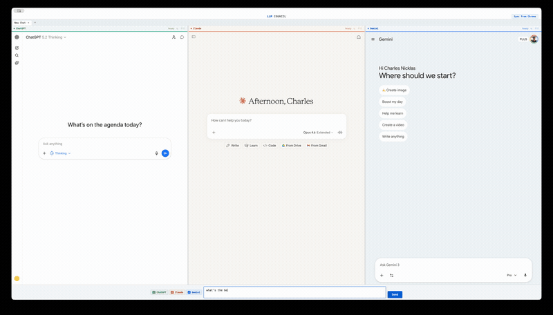

<div align="center">


# LLMux

**One input. Three models. Instant answers.**

Multiplex your queries across ChatGPT, Claude, and Gemini in a single window — or toggle down to just the one you need. Launch from Raycast or use directly.

<br>



<br>

[Install](#install) · [Features](#features) · [Shortcuts](#keyboard-shortcuts) · [How It Works](#how-it-works)

</div>

---

## Features

- **Multiplexed queries** — all three models in one frame, answering the same question. Resize panels by dragging dividers. Compare reasoning, tone, and accuracy at a glance.
- **Single-model mode** — toggle off what you don't need with `Cmd+Shift+1/2/3`, or use the command palette to "Show Only Claude." New tabs inherit your selection.
- **Tabbed conversations** — `Cmd+T` opens a new tab with fresh sessions. Tabs auto-rename from conversation titles as responses come in.
- **Command palette** — `Cmd+K` opens a fuzzy-search palette with every action in the app. Toggle platforms, reload panels, rename tabs, switch themes.
- **Raycast integration** — install the bundled extension and query your models from anywhere on your Mac. LLMux opens, creates a new tab, and fires the query to all active models.
- **Cookie sync** — click **Sync from Chrome** to import your existing browser sessions. No need to log into each platform again.
- **Theme support** — switch between Light, Dark, and System themes.

## Install

### Homebrew (recommended)

```bash
brew install charlesnchr/tap/llmux
```

### Download

Grab the `.dmg` from the [Releases](https://github.com/charlesnchr/llmux/releases) page and drag to Applications. On first launch, if macOS blocks the app, run:

```bash
xattr -cr /Applications/LLMux.app
```

### From source

```bash
git clone https://github.com/charlesnchr/llmux.git
cd llmux
npm install
npx electron .
```

### Raycast extension

```bash
cd raycast-extension
npm install && npm run build
```

Then open Raycast, go to Extensions, and import the built extension from the directory.

## Keyboard Shortcuts

| Shortcut | Action |
|:--|:--|
| `Cmd+K` or `Cmd+/` | Command palette |
| `Cmd+L` | Focus query input |
| `Cmd+Shift+1` | Toggle ChatGPT |
| `Cmd+Shift+2` | Toggle Claude |
| `Cmd+Shift+3` | Toggle Gemini |
| `Cmd+Shift+R` | Reload all panels |
| `Cmd+N` | New chat (reset current tab) |
| `Cmd+T` | New tab |
| `Cmd+W` | Close tab |
| `Cmd+1`--`9` | Jump to tab |
| `Ctrl+Tab` / `Ctrl+Shift+Tab` | Next / previous tab |

Everything is also accessible through the command palette.

## How It Works

Each platform runs in an Electron `<webview>` with its own `persist:` session partition, so cookies and state are fully isolated between models.

When you press Send, platform-specific injection scripts locate the input field in each webview's DOM (handling contenteditable divs, ProseMirror editors, shadow DOM in Gemini), insert the query text, and programmatically click the send button.

The Raycast extension communicates via the `llmux://` custom URL protocol. When you send a query from Raycast, it opens `llmux://query?text=...`, which the Electron app intercepts, creates a new tab, and injects the query.

Cookie import reads Chrome's encrypted SQLite cookie database on macOS, decrypts values using PBKDF2-derived keys from the Chrome Safe Storage keychain entry, and loads them into each webview's session.

### Requirements

- **macOS** (Apple Silicon) — cookie import uses the macOS Keychain
- **Chrome** — logged into the three platforms
- **Node.js 18+** (only needed when running from source)

## License

MIT
